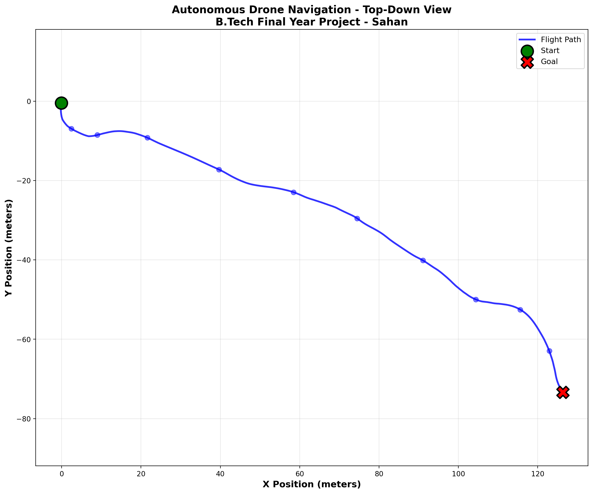
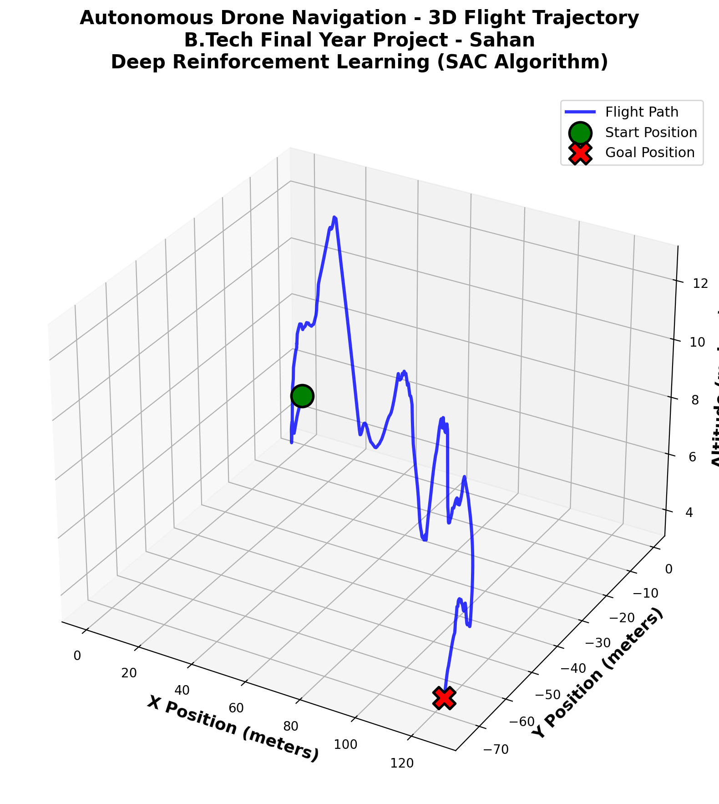

# Deep Reinforcement Learning for Autonomous UAV Navigation


This repository contains an end-to-end Deep Reinforcement Learning (DRL) framework for autonomous UAV navigation using Microsoft AirSim. The project includes custom training environments, DRL pipelines, AirSim integration, and visualization tools for evaluating UAV navigation performance.

---

## 🚀 Features

- Custom UAV navigation environment (Gym-style)
- DRL training and testing pipeline (`simple_train_test.py`)
- Demo flight execution (`demo_project.py`)
- 2D and 3D trajectory visualization (`plot_trajectory.py`)
- Live 3D animated visualization (`live_3d_demo.py`)
- AirSim settings included for plug-and-play simulation
- Organized logs for training and evaluation

---

## 📁 Project Structure

```
UAV_Navigation_DRL_AirSim/
│
├── AirSim_Environments/
├── airsim_settings/
├── configs/
├── drone_env_windows/
├── gym_env/
├── scripts/
├── stable-baselines3/
├── tools/
│
├── demo_project.py
├── plot_trajectory.py
├── live_3d_demo.py
├── simple_train_test.py
│
├── logs_eval/
├── logs_save/
│
├── PROJECT_DEMO_2D_TopView.png
├── PROJECT_DEMO_3D_Trajectory.png
│
└── README.md
```

Other folders in the repo:
```
drone_env/
WebDashboard/
```

---

## ⚙️ Installation

### 1. Clone the repository
```bash
git clone https://github.com/Sahana1230spec/deep-rl-drone-navigation.git
cd deep-rl-drone-navigation/UAV_Navigation_DRL_AirSim
```

### 2. Create virtual environment (Windows)
```powershell
python -m venv drone_env_windows
.\drone_env_windows\Scripts\activate
```

### 3. Install dependencies
```bash
pip install --upgrade pip
pip install -r requirements.txt
```

### 4. Configure AirSim
Copy a JSON file from:
```
airsim_settings/
```
into:
```
Documents/AirSim/settings.json
```

---

## ▶️ Usage

### Train + Test an Agent
```bash
python simple_train_test.py
```

### Run a Demo Flight
```bash
python demo_project.py
```

### Plot 2D / 3D Trajectories
```bash
python plot_trajectory.py
```

### Live 3D Visualization
```bash
python live_3d_demo.py
```

---

## 📊 Results (Add after uploading)

```


```

---

## 🛠 Tech Stack

- Python  
- PyTorch  
- Stable-Baselines3  
- Microsoft AirSim  
- Gym (custom environment)  
- NumPy, Matplotlib  
- HTML/CSS (WebDashboard)

---

## 📄 License

This project is licensed under the MIT License.

---

## 🙏 Acknowledgments

- Microsoft AirSim  
- Stable-Baselines3  
- OpenAI Gym community  

---

## ⭐ Support

If you find this project useful, please consider starring the repository!
